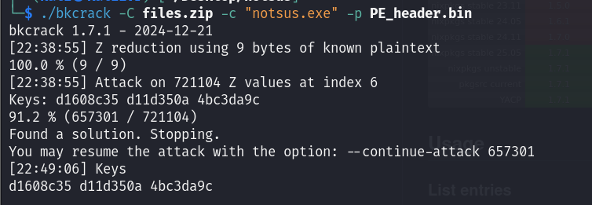
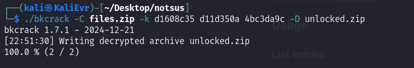
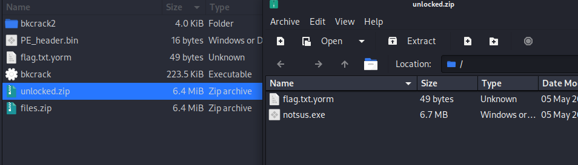
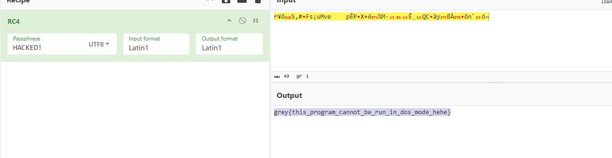

### Notsus

#### 1. Crack ZIP password

I tried with hashcat and john to crack hash extracted from files.zip using `zip2john `

```
$pkzip$2*1*1*0*0*24*0ec8*71194974ea510e5059a59390f82dddf5cf2ce92cdda059732c5c86e725515169f8282167*2*0*3d*31*d4bef751*0*2b*0*3d*d4be*b314af2a294b308f6604b3c4d88adfa54bbfaa45511cbeed88a4af9ac5ee8dc4d00ffd0c2351ea5ad5bc424e24541c9ebe23c9424424082af2a6c38b51*$/pkzip$
```

But with 6 characters password: exhausted. So I cant do this chall in time.

When CTF ended, my teammate said that we had to using `BKcrack` to crack this file. It's why have this writeup :< (my bads)



```
d1608c35 d11d350a 4bc3da9c
```

So we can remove password from zip.



File is unlocked!



And my team mate do



And, PE file is written in Python, so we can extract pyc and decompile to source. That's all.