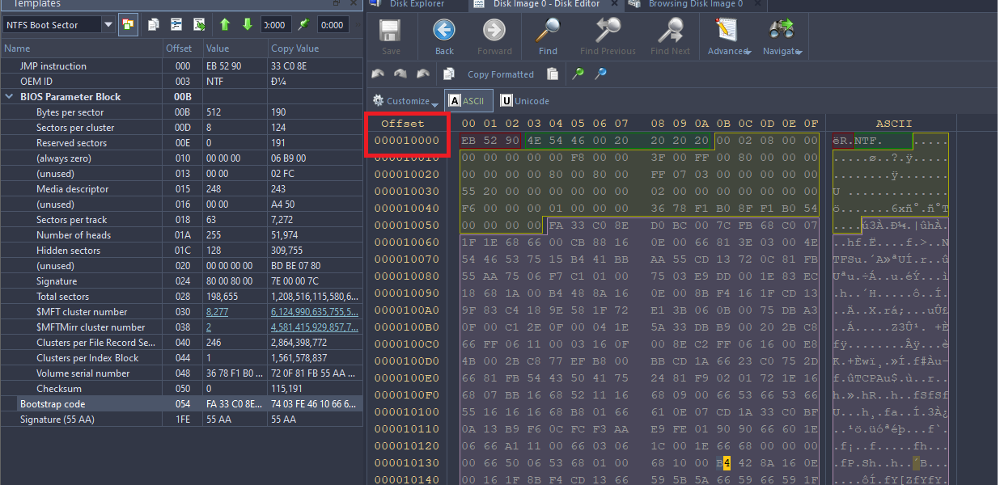
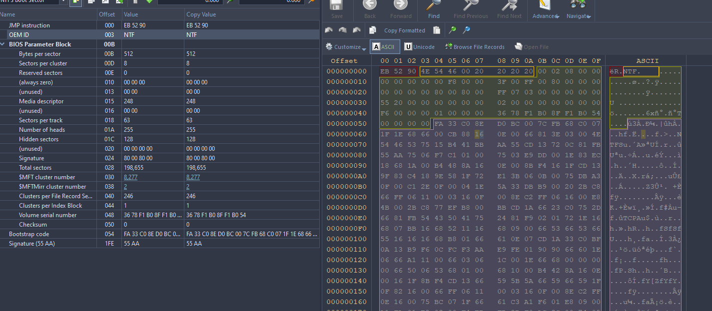
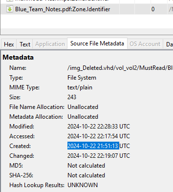
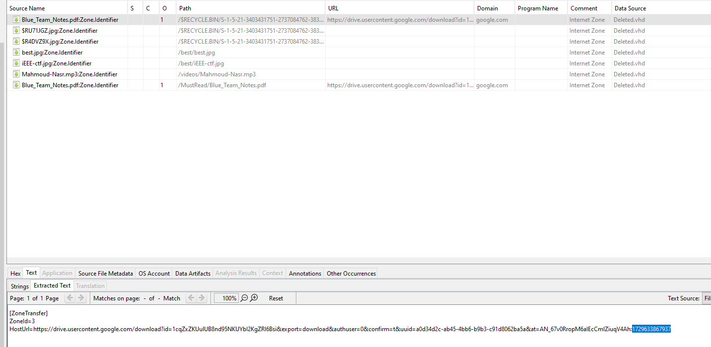
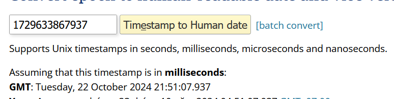
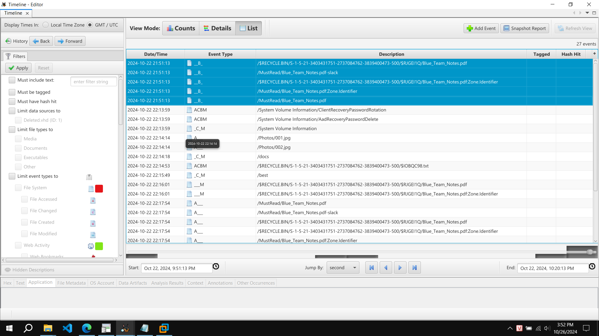
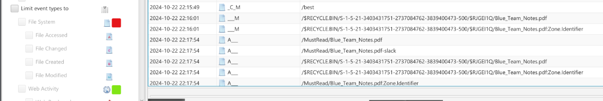
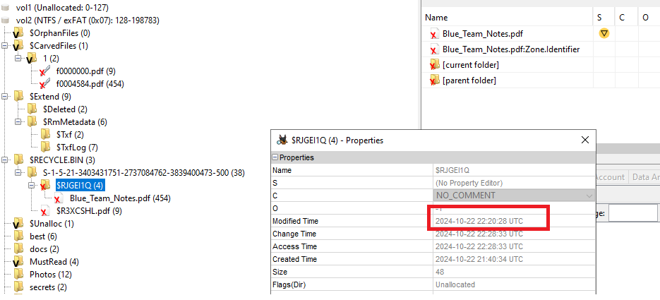

# Corrupted Hard Drive - forensics

Full answer here:
```
nc IP PORT

Welcome to the FORENSIC challenge!
Answer all the questions correctly to get the flag!
[1]. What is the starting address of the LBA address? Format (0xXXXXX)
0x10000
[+] Correct!
[2]. What is the tampered OEM ID? Format (0xXXXXXXXXXXXXXXXX)
0x4E54460020202020
[+] Correct!
[3]. After Fixing the disk, my friend downloaded a file from Google, what is the exact time when he clicked to download that file? Eg: 2024-01-01 01:01:01
2024-10-22 21:51:13
[+] Correct!
[4]. How much time did that file take to for download (in seconds)?? Format  (XXX)
126
[+] Correct!
[5]. The first directory he moved this file to?
best
[+] Correct!
[6]. Last directory the suspicious move the file to?
MustRead
[+] Correct!
[7]. The time he of the deletion?? Eg: 2024-01-01 01:01:01
2024-10-22 22:20:28
[+] Correct!
[+] Congrats! You have successfully completed the test.
Here's your reward: ISITDTU{https://www.youtube.com/watch?v=yqp61_Wqm-A}
```

Question 1:
Using Active Disk Imager (ADI), first NTFS boot sector start from `0x10000`



Question 2: OEM ID tampered.
Using ADI, NTFS partition's OEM is 8 bytes longlong (NTFS 0x20202020)
Check in image, it corrupted (lost `S` character in `NTFS`)
=>`0x4E54460020202020`


I fix header by patch OEM ID to `0x4E54465320202020`

Question 3:
Load image to Autopsy, UTC timezone 

- Check Web Downloads, got file `Blue_Team_Notes.pdf` has time created: `2024-10-22 21:51:13`




Question 4: How much time did that file take to for download (in seconds)?? 

We cant find any activities after `21:51:13 UTC`  to demonstrate that the download completed. But we got epouch timestamp in file download link. So we think chall got some mistake in time.



Epouch timestamp in here is: `1729633867937` == `2024-10-22 21:51:07` before `2024-10-22 21:51:13`(in question 3)



So we create python script to brute force `XXX `value in question 4:

```python
import socket

class Netcat:
    def __init__(self, ip, port):

        self.buff = b""
        self.socket = socket.socket(socket.AF_INET, socket.SOCK_STREAM)
        self.socket.connect((ip, port))

    def read(self, length = 1024):
        print("read len: %i" % len(self.buff))		
        if len(self.buff) >= length:
            rval = self.buff[:length]
            self.buff = self.buff[length:]
        else:
            while len(self.buff) < length:
                self.buff += self.socket.recv(1)
			
            rval = self.buff[:length]
            self.buff = self.buff[length:]
        print("print rval: %s" % rval)
        return rval

    def read_until(self, data):
        while not data in self.buff:
            self.buff += self.socket.recv(1024)
 
        pos = self.buff.find(data)
        rval = self.buff[:pos + len(data)]
        self.buff = self.buff[pos + len(data):]
 
        return rval
		
    def readline(self):
        return self.read_until(b"\n")
		
    def readall(self):
        while True:
            part = self.socket.recv(1024)
            self.buff += part
            if len(part) < 1024:
                # either 0 or end of data
                break
        
        rval = self.buff[:len(self.buff)]
        self.buff = b''
        return rval

    def write(self, data):
        self.socket.send(data)
	
    def writeline(self, data):
        self.socket.send(data + b'\x0a')
    
    def close(self):
        self.socket.close()


HOST = "152.69.210.130"
PORT = 1411 

import time

XXX = 100
while(True):
    nc = Netcat(HOST, PORT)
    time.sleep(0.2)
    print(nc.readall())
    nc.writeline(b"0x10000")
    time.sleep(0.2)
    print(nc.readall())
    nc.writeline(b"0x4E54460020202020")
    time.sleep(0.2)
    print(nc.readall())
    nc.writeline(b"2024-10-22 21:51:13")
    time.sleep(0.2)
    print(nc.readall())
    

    nc.writeline(str(XXX).encode())
    time.sleep(0.2)
    data = nc.readall()
    
    if("Wrong" in data.decode()):
        XXX +=1
        time.sleep(2)
    else:
        print("XXX=", XXX)
        break

#### Got XXX=126
```

Easy to get `XXX = 126`

Question 5: The first directory he moved this file to?

Check timeline in Autopsy, he access and delete file in `best` folder. 



Question 6:

By timeline, this PDF in folder `MustRead`



Question 7: The time he of the deletion?? 

I check in RECYCLE.BIN, Modified time folder contains file is time to deletion



`2024-10-22 22:20:28`