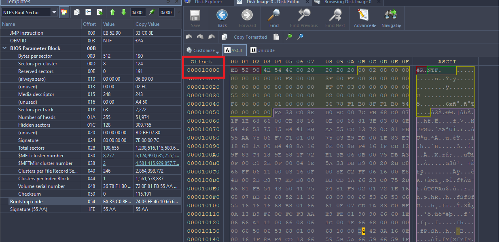
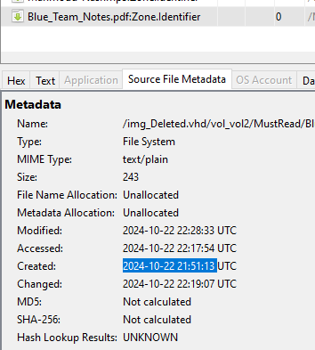
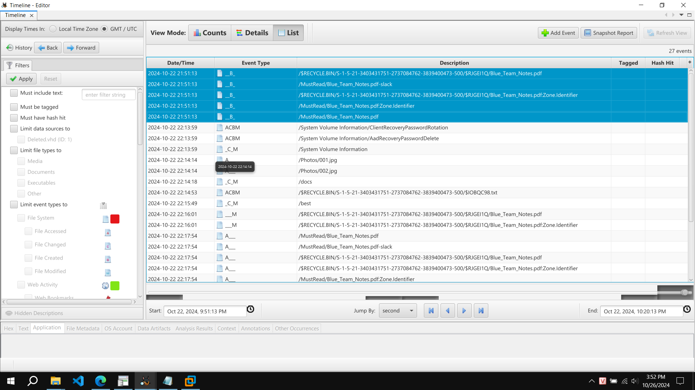
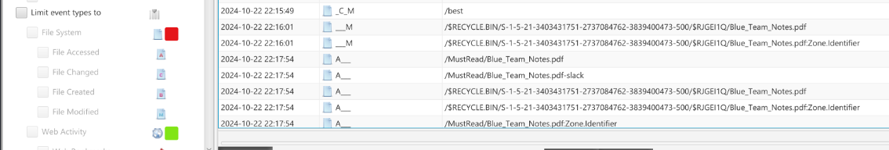

# Corrupted Hard Drive - forensics

Full answer here:
```
nc 152.69.210.130 1411

Welcome to the FORENSIC challenge!
Answer all the questions correctly to get the flag!
[1]. What is the starting address of the LBA address? Format (0xXXXXX)
0x10000
[+] Correct!
[2]. What is the tampered OEM ID? Format (0xXXXXXXXXXXXXXXXX)
0x4E54460020202020
[+] Correct!
[3]. After Fixing the disk, my friend downloaded a file from Google, what is the exact time when he clicked to download that file? Eg: 2024-01-01 01:01:01
2024-10-22 21:51:13
[+] Correct!
[4]. How much time did that file take to for download (in seconds)?? Format  (XXX)
126
[+] Correct!
[5]. The first directory he moved this file to?
best
[+] Correct!
[6]. Last directory the suspicious move the file to?
MustRead
[+] Correct!
[7]. The time he of the deletion?? Eg: 2024-01-01 01:01:01
2024-10-22 22:20:28
[+] Correct!
[+] Congrats! You have successfully completed the test.
Here's your reward: ISITDTU{https://www.youtube.com/watch?v=yqp61_Wqm-A}
```

Question 1:
Using Active Disk Imager (ADI), first NTFS boot sector start from `0x10000`



Question 2: OEM ID tampered.
Using ADI, NTFS partition's OEM is 8 bytes longlong (NTFS 0x20202020)
Check in image, it corrupted (lost S char)
=>`0x4E54460020202020`


Question 3:
Load image to AutoSpy, UTC timezone 

- Check Web Downloads, got file `Blue_Team_Notes.pdf` has time created: `2024-10-22 21:51:13`




Question 4: How much time did that file take to for download (in seconds)?? 


Question 5: The first directory he moved this file to?

Check timeline in AutoSpy, he access and delete file in `best` folder. 



Question 6:

By timeline, this PDF in folder `MustRead`



Question 7: The time he of the deletion?? 

I check in RECYCLE.BIN, Modified time folder contains file is time to deletion


`2024-10-22 22:20:28`