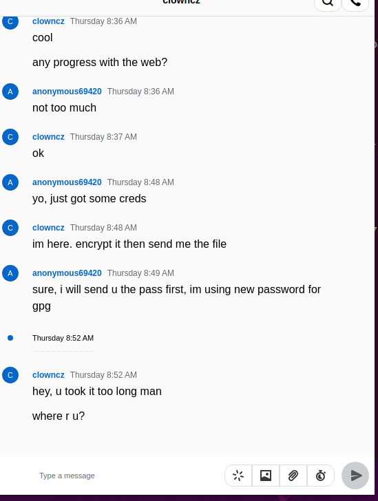
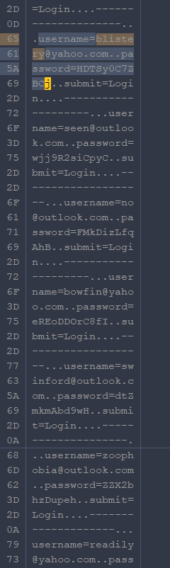

Ques 9:

Answer: `23`

We need to find credentials.txt

But it file encrypted by `gpg -c` with symmetric encryption. So we have 3 ways:

- Check password in Wire chat
- Crack encryption
- Recovery plain text file from vmdk disk.

Let's do it!

- Option 1: We start VM in VMware and got this chat:

So first option is not possible because he not share for partner.

- Option 2: Crack encryption

We try to crack with rockyou.txt but with our high performance server, need 8 hours to try rockyou dict (Not good idea)

- Option 3: 

So we try mount /ext4 partition using `ArsenalImageMounter` and run Recovery file in this disk.

We found text data with 23 credential.

Question 10:

With data recovery in text data, we found:

`username=blistery@yahoo.com..password=HDTSy0C7ZBCj `

