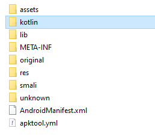
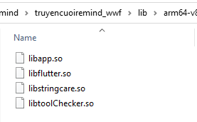
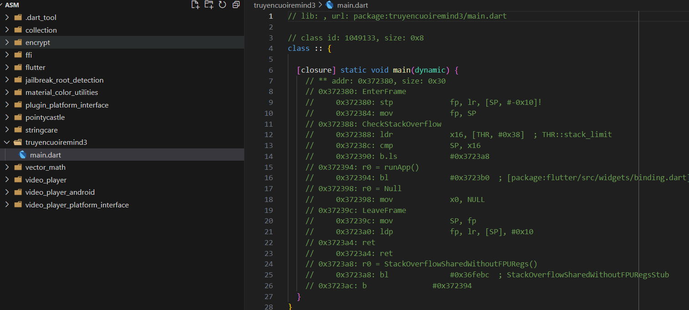
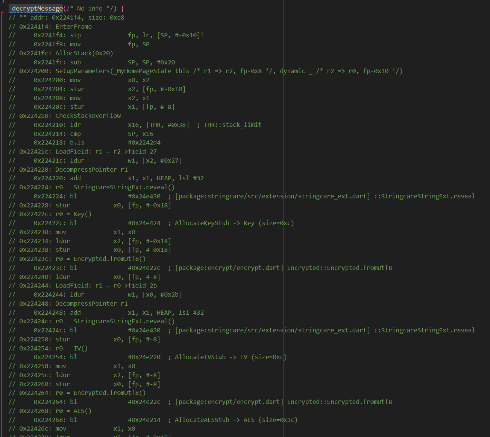
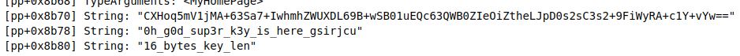
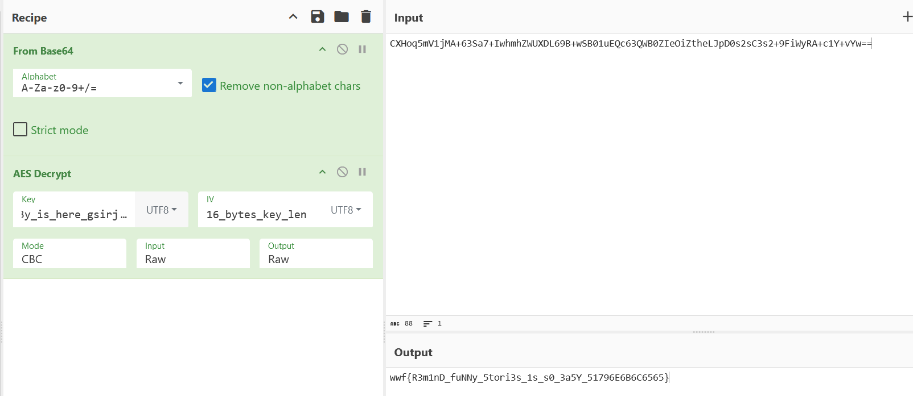

### Remind's funny stories 3

Author: Qynklee

- Decrypt APK using APKTool



- In `lib` folder, we have 4 subfoler for cpu architect arm, arm64, x86 and x86_64. And in every subfolder, have same file:
    

    

    `libflutter.so` is a native library from Flutter framework. So this app built from Flutter (using Dart language). 

    So reverse Flutter android app is different than Java or Kotlin app because, Flutter compile code to native code not to bytecode like Java.

    All user-code compiled to `libapp.so` in Flutter.

- Using [blutter](https://github.com/worawit/blutter), run tool with `libapp.so`file in `armv8-64`, we have assembly code compiled in libapp.so. 
    

- Read main.dart, we can found all function: _processCheckJailbreakRoot, _showSecurityDialog, _incrementCounter, _showWinnerDialog and 

    decryptMessage.

    

    decryptMessage does base64 decoding and AES decryption with an IV Key. So need to find them from `pp.txt` file (output of `blutter` )

- In `pp.txt`, we have:



```
"CXHoq5mV1jMA+63Sa7+IwhmhZWUXDL69B+wSB01uEQc63QWB0ZIeOiZtheLJpD0s2sC3s2+9FiWyRA+c1Y+vYw=="

"0h_g0d_sup3r_k3y_is_here_gsirjcu"

"16_bytes_key_len"
```

Decrypt base64 string using AES_CBC mode, we got flag:



```
wwf{R3m1nD_fuNNy_5tori3s_1s_s0_3a5Y_51796E6B6C6565}
```

Cheeeeerrsss. :smile:

